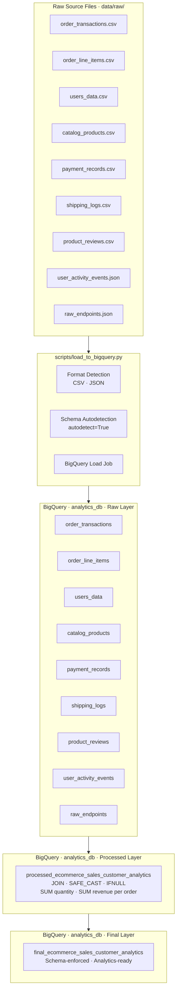

# E-Commerce Data Pipeline for Sales & Customer Analytics

> A cloud-native ELT pipeline that ingests multi-format e-commerce data into Google BigQuery and delivers clean, analytics-ready tables through a two-layer SQL transformation architecture.

<br>

---

## Table of Contents

- [Overview](#overview)
- [Tech Stack](#tech-stack)
- [Project Structure](#project-structure)
- [System Architecture](#system-architecture)
- [Data Pipeline Flow](#data-pipeline-flow)
- [Data Sources](#data-sources)
- [SQL Transformation Layers](#sql-transformation-layers)
- [Getting Started](#getting-started)
- [Author](#author)

---

## Overview

This project implements a production-style **ELT (Extract → Load → Transform)** pipeline for e-commerce analytics. Raw transactional and behavioural data from nine source files is ingested into BigQuery, then transformed through two structured SQL layers to produce a clean, schema-enforced output table ready for reporting and downstream analysis.

**What the pipeline delivers:**

- Ingests 9 raw data sources (CSV and JSON) into BigQuery with automatic schema detection
- Joins order transactions with line-item detail to compute per-order revenue and quantity metrics
- Enforces type safety across all fields using `SAFE_CAST` and null-safe defaults via `IFNULL`
- Outputs a final analytics table structured for direct use in BI tools or SQL-based reporting

**System type:** Batch ELT Data Pipeline · Google Cloud Platform

---

## Tech Stack

| Layer | Technology |
|---|---|
| Cloud Data Warehouse | Google BigQuery |
| Ingestion Language | Python 3 |
| GCP Authentication | Application Default Credentials (ADC) |
| Transformation | BigQuery Standard SQL |
| Raw Data Formats | CSV · Newline-Delimited JSON |

---

## Project Structure

```text
ecommerce-data-pipeline/
│
├── scripts/
│   └── load_to_bigquery.py        # Pipeline entry point — loads all source files into BigQuery
│
├── sql/
│   ├── processed_layer.sql        # Layer 1: order aggregation and revenue computation
│   └── final_layer.sql            # Layer 2: type-enforced final output table
│
├── data/
│   └── raw/
│       ├── order_transactions.csv
│       ├── order_line_items.csv
│       ├── users_data.csv
│       ├── catalog_products.csv
│       ├── payment_records.csv
│       ├── shipping_logs.csv
│       ├── product_reviews.csv
│       ├── user_activity_events.json
│       └── raw_endpoints.json
│
└── README.md
```

---

## System Architecture



---

## Data Pipeline Flow

```text
┌─────────────────────────────────────────┐
│         RAW SOURCE FILES                │
│         data/raw/  (9 files)            │
└────────────────────┬────────────────────┘
                     │
                     ▼
┌─────────────────────────────────────────┐
│       load_to_bigquery.py               │
│                                         │
│  · Detects format per file (CSV/JSON)   │
│  · Applies correct LoadJobConfig        │
│  · Autodetects schema                   │
│  · Streams bytes → BigQuery load job    │
└────────────────────┬────────────────────┘
                     │
                     ▼
┌─────────────────────────────────────────┐
│    BigQuery Raw Tables — analytics_db   │
│    9 tables · 1:1 mapping to sources    │
└────────────────────┬────────────────────┘
                     │
                     ▼
┌─────────────────────────────────────────┐
│       processed_layer.sql               │
│                                         │
│  · SAFE_CAST all fields to target types │
│  · LEFT JOIN order_transactions         │
│         → order_line_items ON order_id  │
│  · GROUP BY user_id, order_id,          │
│             order_date                  │
│  · SUM(quantity) → total_quantity       │
│  · SUM(quantity × price) → total_revenue│
│  · IFNULL → zero-fill numeric nulls     │
└────────────────────┬────────────────────┘
                     │
                     ▼
┌─────────────────────────────────────────┐
│       final_layer.sql                   │
│                                         │
│  · Re-applies SAFE_CAST + IFNULL        │
│  · Enforces final output schema         │
└────────────────────┬────────────────────┘
                     │
                     ▼
┌─────────────────────────────────────────┐
│  final_ecommerce_sales_customer_analytics│
│  ✓ Query-ready · BI-ready               │
└─────────────────────────────────────────┘
```

---

## Data Sources

| File | Domain |
|---|---|
| `order_transactions.csv` | Order headers — order ID, user ID, order date |
| `order_line_items.csv` | Line-level detail — product, quantity, price per order |
| `users_data.csv` | Customer and user master records |
| `catalog_products.csv` | Product catalogue and metadata |
| `payment_records.csv` | Payment transaction records |
| `shipping_logs.csv` | Fulfilment and logistics data |
| `product_reviews.csv` | Customer review and rating records |
| `user_activity_events.json` | Behavioural event log |
| `raw_endpoints.json` | API endpoint metadata |

---

## SQL Transformation Layers

### Layer 1 — Processed (`processed_layer.sql`)

Joins order headers with line-item detail and computes per-order revenue metrics.

| CTE | Purpose |
|---|---|
| `orders` | Casts `order_id`, `user_id`, `order_date` from `order_transactions` |
| `order_items` | Casts and null-fills `order_id`, `product_id`, `quantity`, `price` from `order_line_items` |
| `aggregated` | LEFT JOIN on `order_id` · GROUP BY user, order, date · SUM quantity and revenue |
| Final SELECT | Re-applies `SAFE_CAST` and `IFNULL` to guarantee output types |

**Output:** `analytics_db.processed_ecommerce_sales_customer_analytics`

---

### Layer 2 — Final (`final_layer.sql`)

Enforces the output schema and produces the clean analytics endpoint.

| Column | Type | Default |
|---|---|---|
| `user_id` | INT64 | SAFE_CAST |
| `order_id` | INT64 | SAFE_CAST |
| `order_date` | DATE | SAFE_CAST |
| `total_quantity` | INT64 | 0 |
| `total_revenue` | FLOAT64 | 0.0 |

**Output:** `analytics_db.final_ecommerce_sales_customer_analytics`

---

## Getting Started

### Prerequisites

- Python 3.8+
- Google Cloud SDK installed and authenticated
- BigQuery dataset `analytics_db` created under project `de-project-493506`

### Configure GCP Authentication

```bash
gcloud auth application-default login
```

### Install Dependencies

```bash
pip install google-cloud-bigquery
```

### Prepare Raw Data

```bash
mkdir -p data/raw
# Place all 9 source files into data/raw/
```

### Run the Ingestion Pipeline

```bash
python scripts/load_to_bigquery.py
```

Expected output:

```text
Loaded order_transactions.csv → de-project-493506.analytics_db.order_transactions
Loaded order_line_items.csv → de-project-493506.analytics_db.order_line_items
Loaded users_data.csv → de-project-493506.analytics_db.users_data
Loaded catalog_products.csv → de-project-493506.analytics_db.catalog_products
Loaded payment_records.csv → de-project-493506.analytics_db.payment_records
Loaded shipping_logs.csv → de-project-493506.analytics_db.shipping_logs
Loaded product_reviews.csv → de-project-493506.analytics_db.product_reviews
Loaded user_activity_events.json → de-project-493506.analytics_db.user_activity_events
Loaded raw_endpoints.json → de-project-493506.analytics_db.raw_endpoints
```

### Run SQL Transformations

```bash
# Layer 1 — Processed
bq query --use_legacy_sql=false < sql/processed_layer.sql

# Layer 2 — Final
bq query --use_legacy_sql=false < sql/final_layer.sql
```

---

## Author

**Maliki Habib Samuel**
